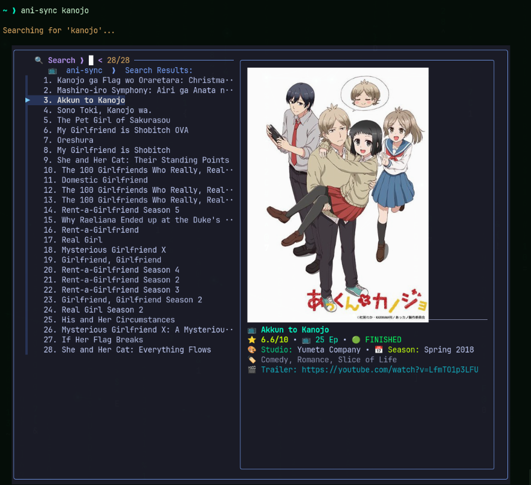
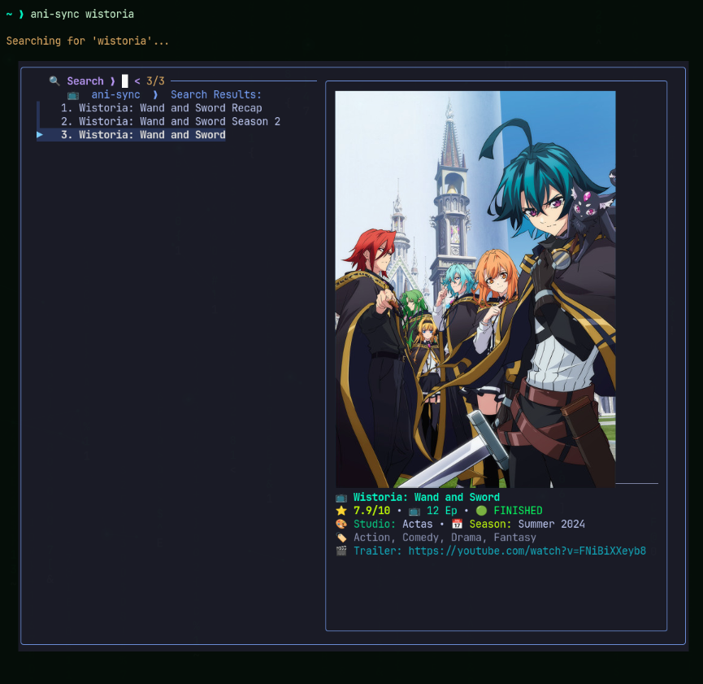

<p align="center">
  
</p>

<h1 align="center">📺 ani-sync</h1>

<p align="center">
  <b>The Ultimate High-Performance Terminal Anime Streaming & Multi-Platform Auto-Sync Engine</b>
</p>

<p align="center">
  <i>Stream any anime directly in your terminal with <b>zero-buffering HLS playback</b>, <b>interactive FZF live search with cover art previews</b>, <b>frame-accurate AniSkip intro/outro skipping</b>, <b>Syncplay watch-together party rooms</b>, and <b>real-time watch progress sync to MyAnimeList, AniList & Kitsu</b>.</i>
</p>

<p align="center">
  <a href="https://github.com/idrisharis12/ani-sync/stargazers"></a>
  <a href="https://github.com/idrisharis12/ani-sync/releases"></a>
  <a href="LICENSE"></a>
  <a href="https://www.python.org/"></a>
  <br>
  
  
  
  
  
  
</p>

<p align="center">
  <a href="#-quick-installation">⚡ Quick Installation</a> •
  <a href="#-platform-installer-matrix">📦 OS Installers</a> •
  <a href="#-core-features">✨ Core Features</a> •
  <a href="#-detailed-usage--command-recipes">🚀 Usage Recipes</a> •
  <a href="#-keyboard-shortcuts--cheatsheet">⌨️ Keybindings</a> •
  <a href="#-tracking--account-authentication">🔑 Auth Setup</a> •
  <a href="#-system-diagnostics--doctor">🩺 Doctor</a>
</p>

---

<div align="center">
<pre><code>
  📺 <b style="color: #00E676;">ani-sync</b> ❯ 🔍 Search: <i style="color: #FFD700;">kanojo</i>  <span style="color: #89b4fa;">[79 Results Found]</span>
  ╭────────────────────────────────────────────────────────────────────────────────╮
  │ <span style="color: #00E676;">▶</span> 01. Ore Monogatari!! (24 Episodes) [1080p/720p]                              │
  │   02. Kanojo, Okarishimasu (Rent-a-Girlfriend)                                │
  │   03. Saenai Heroine no Sodatekata                                             │
  │   04. Kanojo ga Flag wo Oraretara                                              │
  ╰────────────────────────────────────────────────────────────────────────────────╯
  ⚡ <b style="color: #00E676;">[Zero-Buffer Stream Engine]</b> ──► [RAM Disk: /dev/shm] ──► <b style="color: #FFD700;">[MPV Instant Launch]</b>
  ⏩ <b style="color: #FF6F00;">[AniSkip Auto Skip: OP 01:25 ➔ 02:55]</b> ──► [Theme: TokyoNight TrueColor]
  🔄 <b style="color: #7C4DFF;">[Cloud Auto-Sync: MAL ✓ | AniList ✓ | Kitsu ✓]</b> ──► [Discord RPC Active 🎮]
</code></pre>
</div>

---

## ⚡ Quick Installation

Choose your operating system below to install `ani-sync` and all required media playback tools (`mpv`, `fzf`, `chafa`, `ffmpeg`, `python3`) with **one command**:

### 🐧 Linux (Arch Linux, Ubuntu, Debian, Fedora, openSUSE, Alpine, Void)
```bash
curl -fsSL https://raw.githubusercontent.com/idrisharis12/ani-sync/main/install.sh | bash
```

### 🏹 Arch Linux (AUR Package)
```bash
yay -S ani-sync
# or
paru -S ani-sync
```

### 🍎 macOS (Homebrew)
```bash
brew install fzf mpv yt-dlp chafa curl git ffmpeg python3
curl -fsSL https://raw.githubusercontent.com/idrisharis12/ani-sync/main/install.sh | bash
```

### 📱 Android (Termux)
```bash
pkg update && pkg install -y fzf mpv yt-dlp chafa curl git ffmpeg python termux-api
curl -fsSL https://raw.githubusercontent.com/idrisharis12/ani-sync/main/install.sh | bash
```

### 🪟 Windows (PowerShell)
```powershell
iwr -useb https://raw.githubusercontent.com/idrisharis12/ani-sync/main/install.ps1 | iex
```

---

## 📦 Platform Installer Matrix

| Platform | Recommended Package Manager | Automatic Tool Installation (`mpv`, `fzf`, `chafa`, `ffmpeg`) | One-Liner Command |
| :--- | :--- | :---: | :--- |
| **Arch Linux / Manjaro** | `pacman` / `yay` / `paru` | ✅ Automated | `yay -S ani-sync` |
| **Ubuntu / Debian / Mint** | `apt-get` | ✅ Automated | `curl -fsSL https://raw.githubusercontent.com/idrisharis12/ani-sync/main/install.sh \| bash` |
| **Fedora / RHEL / Alma** | `dnf` | ✅ Automated | `curl -fsSL https://raw.githubusercontent.com/idrisharis12/ani-sync/main/install.sh \| bash` |
| **openSUSE Tumbleweed** | `zypper` | ✅ Automated | `curl -fsSL https://raw.githubusercontent.com/idrisharis12/ani-sync/main/install.sh \| bash` |
| **Alpine Linux** | `apk` | ✅ Automated | `curl -fsSL https://raw.githubusercontent.com/idrisharis12/ani-sync/main/install.sh \| bash` |
| **macOS (Intel / Apple Silicon)** | `brew` (Homebrew) | ✅ Automated | `curl -fsSL https://raw.githubusercontent.com/idrisharis12/ani-sync/main/install.sh \| bash` |
| **Android (Termux)** | `pkg` | ✅ Automated | `curl -fsSL https://raw.githubusercontent.com/idrisharis12/ani-sync/main/install.sh \| bash` |
| **Windows 10 / 11** | `winget` / PowerShell | ✅ Automated | `iwr -useb https://raw.githubusercontent.com/idrisharis12/ani-sync/main/install.ps1 \| iex` |

---

## ✨ Core Features

| Feature | Description |
| :--- | :--- |
| 🚀 **Zero-Buffering Playback Engine** | HLS stream prefetching and in-memory segment caching — completely eliminates stutter, buffering delays, and video freezes. |
| 🔍 **Interactive FZF Live Search** | Filter anime titles instantly with keystrokes, arrow-key navigation, and live high-res cover art previews via `chafa`, Kitty graphics, or ANSI graphics. |
| 📊 **Expanded 100+ Search Results** | Multi-threaded offset pagination across AniDB, Kitsu, Jikan (MAL), and AniList ensures you find every season, OVA, movie, and spin-off. |
| ⏩ **Frame-Accurate AniSkip Integration** | Queries `api.aniskip.com` for millisecond-precise intro/outro timestamps. Auto-skips openings/endings and supports `[Tab]`/`[i]`/`[o]` hotkeys. |
| 🔄 **Multi-Platform Auto-Sync Tracking** | Automatically syncs watched episodes and scores in real-time to **MyAnimeList**, **AniList**, and **Kitsu** in background threads. |
| 🎉 **Syncplay Watch Party Mode** | Watch anime together in real-time synced rooms with friends anywhere in the world using `ani-sync party`. |
| 🎨 **24-Bit Aesthetic Themes Engine** | Native 24-bit TrueColor themes with matching FZF palettes: `tokyonight`, `catppuccin`, `dracula`, `gruvbox`, `nord`, `monokai`. |
| 📅 **Airing Schedule & Release Calendar** | AniList GraphQL integration with live countdown timers (`Airs in 2h 15m` / `Available Now`) and one-click stream launching via `ani-sync schedule`. |
| 📥 **Turbo Batch & Range Downloader** | Download episode ranges (`ani-sync -d -e 1-12 "title"`) or entire seasons in parallel to `~/Downloads/ani-sync/` with `tqdm` progress bars. |
| 📱 **Termux & Low-RAM Optimization** | Native support for Android Termux with `--lite` and `--low-ram` modes tailored for lower-end hardware and low memory devices. |
| 💬 **Discord Rich Presence** | Automatically broadcasts your current anime, episode number, playback timer, and clickable GitHub links on Discord. |
| 🩺 **Built-In System Doctor** | Run `ani-sync doctor` to verify system dependencies, package versions, binary paths, API keys, and codecs with one command. |

---

## 🎥 Feature Demonstrations & Gallery

<details open>
<summary><b>0. 🔎 Interactive FZF Search with High-Res Cover Art Previews (Click to expand)</b></summary>
<br>
<p align="center">
  <i>ani-sync displays crisp high-resolution anime thumbnails directly inside the FZF preview pane using Chafa, Kitty Graphics protocol, or scaled ANSI graphics!</i><br>
  
  
</p>
</details>

<details>
<summary><b>1. 🚀 Zero-Buffering Stream Engine & AniSkip Intros (Click to expand)</b></summary>
<br>
<p align="center">
  <i>Instant MPV launch with frame-accurate AniSkip opening & ending skips!</i><br>
  
</p>
</details>

---

## 🚀 Detailed Usage & Command Recipes

### 1. 🔍 Interactive Anime Search & Playback
Launch interactive search or search directly by title:
```bash
# Launch interactive search menu
ani-sync

# Search directly for an anime
ani-sync "frieren"

# Search and specify episode target directly
ani-sync "attack on titan" -e 5
```

### 2. ⏪ Resume & Continue Watching
Resume watching your most recently played anime from the next episode:
```bash
ani-sync -c
# or
ani-sync continue
```

### 3. 📅 Airing Schedule & Calendar
View currently airing anime with live countdown timers and one-click launch:
```bash
ani-sync schedule
```

### 4. 🔥 Browse Top Airing & Trending Anime
Browse currently trending seasonal releases:
```bash
ani-sync -t
# or
ani-sync trending
```

### 5. 🎨 Customizing Color Themes
Switch between 24-bit TrueColor terminal palettes and matching FZF styling:
```bash
# Apply TokyoNight theme
ani-sync theme tokyonight

# Apply Catppuccin theme
ani-sync theme catppuccin

# Apply Dracula theme
ani-sync theme dracula

# Available themes: tokyonight, catppuccin, dracula, gruvbox, nord, monokai
```

### 6. ⏩ AniSkip Intro/Outro Auto-Skip
Automatically skip anime openings and endings during playback:
```bash
# Enable AniSkip auto-skipping
ani-sync --skip "one piece"

# Disable AniSkip auto-skipping
ani-sync --no-skip "frieren"
```

### 7. 📥 Turbo Batch & Range Downloader
Download episode ranges or entire seasons for offline viewing:
```bash
# Download episodes 1 through 12
ani-sync -d -e 1-12 "demon slayer"

# Download all episodes of a season
ani-sync -d --all "solo leveling"

# Download with specific quality preference (1080p / 720p)
ani-sync -d -q 1080p "jujutsu kaisen"
```

### 8. ⭐ In-Terminal Rating & Cloud Sync
Rate an anime from 1 to 10 directly in your terminal and update your tracking accounts:
```bash
ani-sync score
```

### 9. 🎉 Syncplay Watch-Together Party Mode
Create or join a synchronized watch party room with friends:
```bash
ani-sync party
```

### 10. 📱 Termux / Low-RAM Mode
Optimize playback for Android devices or lower-spec machines:
```bash
ani-sync --lite
# or
ani-sync --low-ram
```

---

## ⌨️ Keyboard Shortcuts & Cheatsheet

### 🎬 Playback Controls (Inside MPV)
| Key | Action |
| :---: | :--- |
| `[Space]` / `[k]` | Pause / Resume playback |
| `[f]` | Toggle Fullscreen mode |
| `[Left]` / `[Right]` | Seek backward / forward 5 seconds |
| `[Up]` / `[Down]` | Volume up / down 5% |
| `[m]` | Mute / Unmute audio |
| `[Tab]` | Manually trigger AniSkip to skip intro/outro |
| `[i]` | Print episode metadata and AniSkip timestamps |
| `[s]` | Take a screenshot |
| `[q]` / `[Esc]` | Close current episode and move to post-playback menu |

### 🔍 Search & Selection (Inside FZF)
| Key | Action |
| :---: | :--- |
| `[Up]` / `[Down]` / `[Ctrl+P]` / `[Ctrl+N]` | Navigate up / down options |
| `[Enter]` | Confirm selection |
| `[Ctrl+C]` / `[Esc]` | Cancel selection and exit cleanly to terminal prompt |
| `[Ctrl+U]` | Clear search query text |

---

## 🔑 Tracking & Account Authentication

Link your favorite tracking services to automatically update watched episodes, progress counters, and scores in real-time while you watch:

```bash
# Launch interactive account authentication manager
ani-sync auth
```

Supported tracking providers:
- **MyAnimeList (MAL)** — OAuth2 authorization link & API sync.
- **AniList** — GraphQL Token authorization & real-time sync.
- **Kitsu** — Username & Password / Token sync.

---

## 🩺 System Diagnostics & Doctor

Run `ani-sync doctor` at any time to inspect your installation health, binary dependencies, Python package versions, video codecs, and API credentials:

```bash
ani-sync doctor
```

Example Output:
```text
  ============================================================
           🩺 ani-sync System Health & Diagnostics            
  ============================================================
  ✓ Python Version:     3.12.3 (/usr/bin/python3)
  ✓ ani-sync Version:   v2.11.52
  ✓ fzf:               Ready (/usr/bin/fzf)
  ✓ mpv:               Ready (/usr/bin/mpv)
  ✓ chafa:             Ready (/usr/bin/chafa)
  ✓ ffmpeg:            Ready (/usr/bin/ffmpeg)
  ✓ yt-dlp:            Ready (v2024.04.09)
  ✓ MyAnimeList:       Authenticated (User: Alex)
  ✓ AniList:           Authenticated (User: Alex)
  ✓ Kitsu:             Authenticated (User: Alex)
  ============================================================
  ✨ All systems operational! System ready for zero-buffer streaming.
```

---

## 💖 Open-Source Credits & Acknowledgements

`ani-sync` is built on the shoulders of fantastic open-source projects:
- [MPV Player](https://mpv.io) — The powerful, highly customizable media player engine.
- [fzf](https://github.com/junegunn/fzf) — Interactive command-line fuzzy finder by June Gunn.
- [Chafa](https://github.com/hpjansson/chafa) — High-performance terminal graphics image viewer.
- [AniSkip](https://aniskip.com) — Open anime opening/ending timestamp API.
- [AniList](https://anilist.co), [MyAnimeList](https://myanimelist.net), & [Kitsu](https://kitsu.io) — Anime tracking platforms.

---

## 📄 License

This project is licensed under the **MIT License** — see the [LICENSE](LICENSE) file for details.
