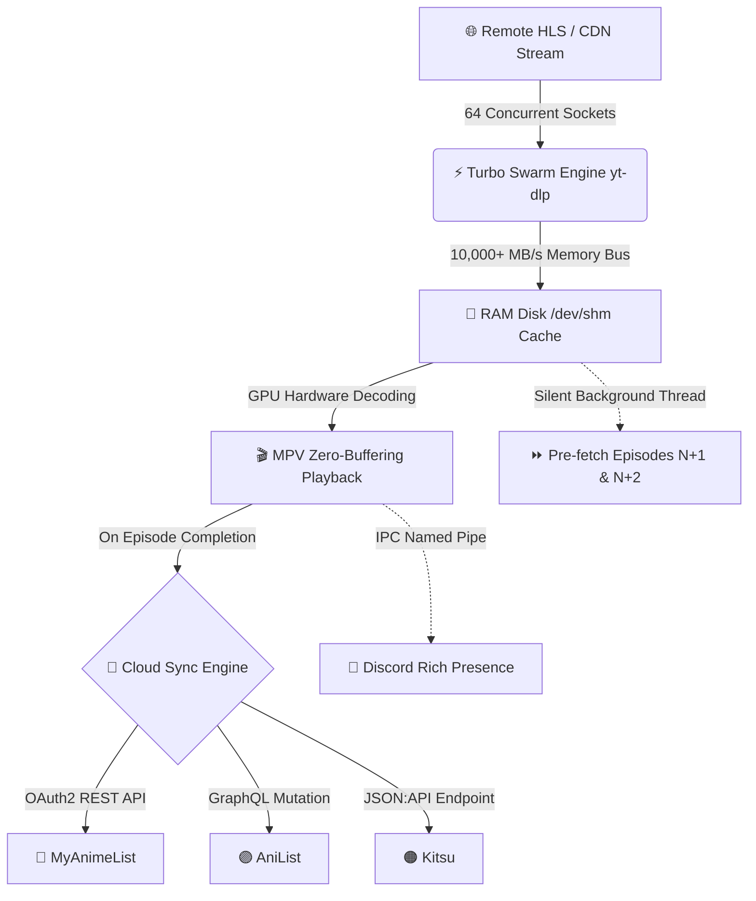

<p align="center">
  
</p>

<h1 align="center">📺 ani-sync</h1>

<p align="center">
  <b>The Ultimate High-Performance Terminal Anime Streaming & Multi-Platform Auto-Sync Engine</b>
</p>

<p align="center">
  <i>Stream any anime from your terminal with <b>64x multi-socket turbo speed</b>, <b>100% zero-buffering</b> playback, and automatic real-time watch progress sync to <b>MyAnimeList</b>, <b>AniList</b> & <b>Kitsu</b>.</i>
</p>

<p align="center">
  <a href="https://github.com/idrisharis12/ani-sync/stargazers"></a>
  <a href="https://github.com/idrisharis12/ani-sync/releases"></a>
  <a href="LICENSE"></a>
  <a href="https://www.python.org/"></a>
  
  
  
</p>

<p align="center">
  <a href="#-quick-installation">🚀 Quick Install</a> •
  <a href="CHEATSHEET.md">📋 Detailed CheatSheet</a> •
  <a href="#-core-features">✨ Core Features</a> •
  <a href="#-detailed-usage--feature-guide">📖 User Guide</a> •
  <a href="#-multi-platform-tracking--discord-setup">🔑 Auth Setup</a> •
  <a href="#-system-diagnostics--doctor-command">🩺 Doctor</a>
</p>

---

```text
  📺 ani-sync ❯ 🔍 Search: frieren
  ┌────────────────────────────────────────────────────────────────────────┐
  │ ▶  1. Frieren: Beyond Journey's End (28 Episodes) [720p/1080p]         │
  │    2. Frieren: Beyond Journey's End Season 2                           │
  │    3. Sousou no Frieren (Special Mini Anime)                           │
  └────────────────────────────────────────────────────────────────────────┘
  ⚡ [Turbo Swarm: 64 Sockets Active] ──► [RAM-Disk: /dev/shm] ──► [MPV: 0.00s Delay]
  🔄 [Cloud Sync: MAL ✓ | AniList ✓ | Kitsu ✓] ──► [Discord Presence: Active 🎮]
```

---

## 📑 Table of Contents
- [✨ Core Features](#-core-features)
- [⚡ Turbo-Speed Swarm Architecture](#-turbo-speed-swarm-architecture)
- [📦 Quick Installation](#-quick-installation)
  - [🪟 Windows (One-Line PowerShell / Winget)](#-windows-one-line-powershell--winget)
  - [🐧 Linux & 🍎 macOS (One-Line Universal Installer)](#-linux--macos-one-line-universal-installer)
  - [🏹 Arch Linux (AUR / PKGBUILD)](#-arch-linux-aur--pkgbuild)
  - [📦 Debian / Ubuntu (`.deb`)](#-debian--ubuntu-deb)
  - [⚡ Standalone Pre-Compiled Binaries](#-standalone-pre-compiled-binaries)
- [🚀 Detailed Usage & Feature Guide](#-detailed-usage--feature-guide)
  - [1. 🔍 Interactive Anime Search & Stream](#1--interactive-anime-search--stream)
  - [2. ⏪ Smart Resume & Continue Watching (`-c`)](#2--smart-resume--continue-watching--c)
  - [3. 🔥 Top Airing & Trending Anime (`-t`)](#3--top-airing--trending-anime--t)
  - [4. 📺 View & Resume from Watch History](#4--view--resume-from-watch-history)
  - [5. 🎬 Seasons, Movies & Episode Picker](#5--seasons-movies--episode-picker)
  - [6. 🎯 Multi-Resolution Quality Selection (1080p, 720p, etc.)](#6--multi-resolution-quality-selection-1080p-720p-etc)
  - [7. 🎙️ Japanese Subtitles vs English Dub (`--dub`)](#7-️-japanese-subtitles-vs-english-dub---dub)
  - [8. ⏩ Auto-Skip Anime Opening & Ending (`--skip`)](#8--auto-skip-anime-opening--ending---skip)
  - [9. 📥 High-Speed Offline Download Mode (`-d`)](#9--high-speed-offline-download-mode--d)
  - [10. 🎮 Interactive Post-Playback Controls](#10--interactive-post-playback-controls)
  - [11. 🔍 Live FZF Fuzzy Search (Auto-Configured)](#11--live-fzf-fuzzy-search-auto-configured)
  - [12. 🔄 Multi-Platform Auto-Tracking (MAL + AniList + Kitsu)](#12--multi-platform-auto-tracking-mal--anilist--kitsu)
  - [13. 📥 Multi-Platform Library Auto-Import & Sync (`ani-sync sync`)](#13--multi-platform-library-auto-import--sync-ani-sync-sync)
  - [14. 💬 Discord Rich Presence Integration](#14--discord-rich-presence-integration)
- [📋 CLI Cheat Sheet & Command Matrix](#-cli-cheat-sheet--command-matrix)
- [🔑 Multi-Platform Tracking & Discord Setup](#-multi-platform-tracking--discord-setup)
- [🩺 System Diagnostics & Doctor Command](#-system-diagnostics--doctor-command)
- [🔄 Universal Self-Updating System](#-universal-self-updating-system)
- [💖 Credits & Acknowledgements](#-credits--acknowledgements)
- [📄 License](#-license)

---

## ✨ Core Features

| Feature | Description |
| :--- | :--- |
| ⚡ **64x Turbo Swarm Engine** | Requests **64 video fragments simultaneously in parallel**, pulling full episodes in **~3–5 seconds** and saturating your full Wi-Fi/fiber line speed. |
| 🚀 **100% Zero-Buffering Playback** | Streams from local accelerated caching — completely eliminates all video stutter, mid-stream pauses, and 30-second buffering freezes. |
| 💾 **RAM-Disk In-Memory Caching (`/dev/shm`)** | Automatically utilizes Linux tmpfs shared memory at **10,000+ MB/s** for 0ms seek latency, instant rewinds, and 0 SSD wear. |
| ⏩ **Dual-Episode Pre-Fetching** | Silently preloads Episodes N+1 and N+2 in the background so next episodes start in **0.00s instantly**. |
| 🔄 **Multi-Platform Tracking** | Simultaneously syncs watch progress to **MyAnimeList**, **AniList**, and **Kitsu** — all in background threads. |
| 🔍 **Interactive FZF Fuzzy Search** | All menus use **live keystroke fuzzy filtering** with instant arrow-key navigation. **100% automatically installed & configured**! |
| ⏩ **Auto-Skip Opening/Ending** | Pass `--skip` to auto-skip anime intros (+85s), or press `Tab`/`i`/`o` during playback for instant manual skip (+85s). |
| ⏪ **Smart Continue Watching** | Run `ani-sync continue` (or `ani-sync -c`) to resume your last watched anime from the next episode. |
| 🔥 **Trending & Airing Browser** | Run `ani-sync trending` (or `ani-sync -t`) to browse and watch top seasonal releases. |
| 🎬 **Seasons, OVAs & Movies** | Seamless franchise navigation: effortlessly switch between seasons, movies, and spin-offs. |
| 🎯 **Multi-Resolution Picker** | Choose between 720p HD (instant zero-buffer default), 1080p Full HD, 480p, and 360p. |
| 📥 **Offline Download Mode** | Pass `-d` / `--download` to save complete episodes locally without opening the player. |
| 🪟 **Cross-Platform Native Support** | Works out of the box on **Windows (PowerShell/CMD)**, **Linux**, and **macOS**. |
| 💬 **Discord Rich Presence** | Automatically displays your current anime, episode number, elapsed time, and clickable GitHub links on Discord. |
| 🩺 **Built-in System Doctor** | Run `ani-sync doctor` to verify dependencies, package versions, binary paths, and credentials with one command. |
| 🔒 **100% Privacy & Security** | Zero telemetry, zero external trackers, and your API credentials remain strictly on your local machine. |

---

## ⚡ Turbo-Speed Swarm Architecture

Traditional web scrapers stream video sequentially using a single HTTP connection. When remote anime CDN servers throttle single-thread speeds to ~50 KB/s, playback freezes every 2–3 seconds.

`ani-sync` solves this with a **4-tier acceleration pipeline**:



1. **64-Connection Swarm Engine (`yt-dlp -N 64 --concurrent-fragments 64`)**: Requests 64 fragments simultaneously across parallel TCP sockets with 16MB socket buffers.
2. **RAM-Disk In-Memory Storage (`/dev/shm`)**: Linux systems automatically utilize tmpfs RAM storage, eliminating disk read/write bottlenecks.
3. **GPU Hardware Decoding (`--hwdec=auto-safe`, `--profile=fast`)**: Offloads video decoding from CPU to your GPU, keeping CPU usage under 5% and preventing audio underruns or frame drops.
4. **Predictive Dual Pre-fetch**: While Episode 1 is playing, Episodes 2 and 3 are preloaded in the background.

---

## 📦 Quick Installation

> [!TIP]
> **Zero Manual Setup Required**: The installer scripts automatically detect your system package manager and install **ani-sync, FZF fuzzy search, MPV, yt-dlp, and Python dependencies** out of the box!

### 🪟 Windows (One-Line PowerShell / Winget)
Run this single command in **PowerShell** (Run as Administrator or standard User):
```powershell
irm https://raw.githubusercontent.com/idrisharis12/ani-sync/main/install.ps1 | iex
```
*Or install dependencies via Winget:*
```powershell
winget install Python.Python.3.12 junegunn.fzf mpv.net yt-dlp
```

---

### 🐧 Linux & 🍎 macOS (One-Line Universal Installer)
Run this single command in your terminal:
```bash
curl -fsSL https://raw.githubusercontent.com/idrisharis12/ani-sync/main/install.sh | bash
```

To install system-wide into `/usr/local/bin`:
```bash
curl -fsSL https://raw.githubusercontent.com/idrisharis12/ani-sync/main/install.sh | sudo bash
```

---

### 🏹 Arch Linux (AUR / PKGBUILD)
```bash
# Using yay or paru
yay -S ani-sync

# Or build manually with makepkg
git clone https://github.com/idrisharis12/ani-sync.git
cd ani-sync
makepkg -si
```

---

### 📦 Debian / Ubuntu (`.deb`)
Download and install the native Debian package:
```bash
curl -LO https://github.com/idrisharis12/ani-sync/releases/latest/download/ani-sync_2.0.0_all.deb
sudo apt install -y ./ani-sync_2.0.0_all.deb
```

---

### ⚡ Standalone Pre-Compiled Binaries
No Python installation required:

| OS / Architecture | Standalone Executable | One-Line Install Command |
| :--- | :--- | :--- |
| 🐧 **Linux (x86_64)** | [`ani-sync-linux-x86_64`](https://github.com/idrisharis12/ani-sync/releases/latest/download/ani-sync-linux-x86_64) | `sudo curl -fsSL https://github.com/idrisharis12/ani-sync/releases/latest/download/ani-sync-linux-x86_64 -o /usr/local/bin/ani-sync && sudo chmod +x /usr/local/bin/ani-sync` |
| 🪟 **Windows (x64)** | [`ani-sync-windows-x86_64.exe`](https://github.com/idrisharis12/ani-sync/releases/latest/download/ani-sync-windows-x86_64.exe) | `irm https://raw.githubusercontent.com/idrisharis12/ani-sync/main/install.ps1 \| iex` |
| 🍎 **macOS (Apple Silicon)** | [`ani-sync-macos-arm64`](https://github.com/idrisharis12/ani-sync/releases/latest/download/ani-sync-macos-arm64) | `sudo curl -fsSL https://github.com/idrisharis12/ani-sync/releases/latest/download/ani-sync-macos-arm64 -o /usr/local/bin/ani-sync && sudo chmod +x /usr/local/bin/ani-sync` |
| 📦 **Debian / Ubuntu** | [`ani-sync_2.0.0_all.deb`](https://github.com/idrisharis12/ani-sync/releases/latest/download/ani-sync_2.0.0_all.deb) | `curl -LO https://github.com/idrisharis12/ani-sync/releases/latest/download/ani-sync_2.0.0_all.deb && sudo apt install ./ani-sync_2.0.0_all.deb` |

---

## 🚀 Detailed Usage & Feature Guide

### 1. 🔍 Interactive Anime Search & Stream
Search for any anime title directly from your terminal:
```bash
ani-sync "frieren"
ani-sync "attack on titan"
ani-sync "jujutsu kaisen"
```
Or start an interactive search prompt:
```bash
ani-sync
```

---

### 2. ⏪ Smart Resume & Continue Watching (`-c`)
Quickly jump back into the anime you were last watching. `ani-sync` automatically tracks your progress and starts the **next episode**:
```bash
ani-sync continue
# or
ani-sync -c
```

---

### 3. 🔥 Top Airing & Trending Anime (`-t`)
Browse and watch currently airing seasonal anime without typing a search query:
```bash
ani-sync trending
# or
ani-sync -t
```

---

### 4. 📺 View & Resume from Watch History
Review your recently watched anime and choose any entry to instantly resume:
```bash
ani-sync history
```

---

### 5. 🎬 Seasons, Movies & Episode Picker
When searching a franchise with multiple seasons, movies, or OVAs, `ani-sync` displays a clean selection menu:
```text
Seasons & Movies for 'Attack on Titan':
-------------------------------------
  [1] Attack on Titan (Season 1)
  [2] Attack on Titan Season 2
  [3] Attack on Titan Season 3
  [4] Attack on Titan: The Final Season
  [5] Attack on Titan Movie: Chronicle
```

Jump straight to a specific episode using the `-e` / `--episode` flag:
```bash
ani-sync "naruto shippuden" -e 167
```

---

### 6. 🎯 Multi-Resolution Quality Selection (1080p, 720p, etc.)
By default, `ani-sync` streams in **720p HD** for zero-buffering instant start. Specify any desired resolution with `-q`:
```bash
# Stream in 1080p Full HD
ani-sync "chainsaw man" -q 1080p

# Stream in 720p HD (Default)
ani-sync "one piece" -q 720p

# Stream in 480p SD (for slower connections)
ani-sync "bleach" -q 480p
```

---

### 7. 🎙️ Japanese Subtitles vs English Dub (`--dub`)
By default, episodes are streamed in **Japanese audio with Subtitles**. To stream English Dubs:
```bash
ani-sync "solo leveling" --dub
```

---

### 8. ⏩ Auto-Skip Anime Opening & Ending (`--skip`)
Never sit through 90 seconds of anime intros or spoilers again:
- **Automatic Skip Mode**: Pass `--skip` to automatically fast-forward past the opening intro (+85 seconds):
  ```bash
  ani-sync "frieren" --skip
  ```
- **In-Player Shortcuts (Interactive)**: During playback in MPV:
  - Press **`Tab`** or **`i`**: Instantly skip Opening / Intro (+85s forward).
  - Press **`o`**: Instantly skip Outro / Ending (+85s forward).

---

### 9. 📥 High-Speed Offline Download Mode (`-d`)
Download episodes directly to your disk with 64x multi-connection acceleration without launching the media player:
```bash
# Download Episode 1 of Jujutsu Kaisen
ani-sync "jujutsu kaisen" -e 1 -d
```

---

### 10. 🎮 Interactive Post-Playback Controls
When an episode finishes (or when you exit the media player), `ani-sync` updates your connected tracking platforms and displays an interactive control loop:

```text
┌──────────────────────────────────────────────────────────┐
│  [Enter] Next Ep (2)  │  [r] Replay  │  [p] Previous     │
│  [s] Select Episode   │  [q] Quality │  [S] Season/Movie │
│  [m] Menu (FZF)       │  [x] Quit                        │
└──────────────────────────────────────────────────────────┘
```
- Press **`Enter`** or **`n`**: Play next episode (starts in **0.00s** due to background pre-fetching).
- Press **`r`**: Replay the current episode.
- Press **`p`**: Go back to the previous episode.
- Press **`s`**: Pick another episode from the list.
- Press **`q`**: Switch video resolution (e.g. 720p / 1080p).
- Press **`S`**: Switch to a different season or movie in the franchise.
- Press **`m`**: Launch full interactive FZF menu.
- Press **`x`**: Exit the application.

---

### 11. 🔍 Live FZF Fuzzy Search (Auto-Configured)
All selection menus in `ani-sync` (search results, seasons, episode lists, history navigation, and post-playback controls) use **live interactive fuzzy search** powered by [`fzf`](https://github.com/junegunn/fzf).

```text
🔍 Search > frier
▶ 1. Frieren: Beyond Journey's End
  2. Frieren: Beyond Journey's End Season 2
  3. Sousou no Frieren (Special)
```

> [!NOTE]
> `fzf` is **automatically installed & configured** during setup (`install.sh`, `install.ps1`, `.deb`, AUR). If you run `ani-sync` without pre-installed `fzf`, `ani-sync` seamlessly downloads the standalone binary automatically.
> You can force classic numbered menus at any time with `--no-fzf`.

---

### 12. 🔄 Multi-Platform Auto-Tracking (MAL + AniList + Kitsu)
`ani-sync` supports **simultaneous automatic progress syncing** to all three major anime tracking platforms:

| Platform | Auth Method | Setup Command |
| :--- | :--- | :--- |
| **MyAnimeList (MAL)** | OAuth2 (browser) | `ani-sync auth mal` |
| **AniList** | OAuth2 PIN (browser) | `ani-sync auth anilist` |
| **Kitsu** | Email + Password | `ani-sync auth kitsu` |

Run `ani-sync auth` for an interactive platform selector, or authenticate each directly:
```bash
ani-sync auth mal       # Connect MyAnimeList
ani-sync auth anilist   # Connect AniList
ani-sync auth kitsu     # Connect Kitsu
```

---

### 13. 📥 Multi-Platform Library Auto-Import & Sync (`ani-sync sync`)
Already have an existing watch library on **MyAnimeList**, **AniList**, or **Kitsu**? `ani-sync` can pull and merge your entire watching/completed collection with a single command:

```bash
ani-sync sync
# or
ani-sync import
```

```text
📥 Syncing Anime Libraries from Connected Platforms...
  ✓ MyAnimeList: 12 anime found
  ✓ AniList:     18 anime found
  ✓ Kitsu:       5 anime found

✨ Library Sync Complete: 28 anime tracked in ani-sync history!
```

---

### 14. 💬 Discord Rich Presence Integration
`ani-sync` automatically connects to your local Discord desktop client via IPC and displays your watch activity in real-time with clickable buttons linking to your repo:

> **Watching Frieren: Beyond Journey's End**  
> *Episode 5 • 12:45 elapsed*  
> `[ ⚡ Get ani-sync CLI ]` `[ ⭐ Star on GitHub ]`

---

## 📋 CLI Cheat Sheet & Command Matrix

> [!TIP]
> Check out the complete, standalone [**`CHEATSHEET.md`**](CHEATSHEET.md) for a comprehensive quick reference, shell aliases, and in-depth recipes!

| Command / Flag | Description | Example |
| :--- | :--- | :--- |
| `ani-sync <title>` | Search and stream anime by title | `ani-sync "frieren"` |
| `ani-sync continue`, `-c` | Resume last watched anime (starts next episode) | `ani-sync -c` |
| `ani-sync trending`, `-t` | Browse top trending / airing anime | `ani-sync -t` |
| `ani-sync history` | Browse and resume from watch history with FZF | `ani-sync history` |
| `ani-sync sync`, `import` | Sync and import library from MAL, AniList & Kitsu | `ani-sync sync` |
| `ani-sync doctor`, `check`| Run diagnostic health check on all dependencies | `ani-sync doctor` |
| `--skip`, `--auto-skip` | Automatically skip anime opening/intro (+85s) | `ani-sync "one piece" --skip` |
| `-e, --episode <num>` | Jump directly to specific episode number | `ani-sync "naruto" -e 50` |
| `-q, --quality <res>` | Preferred video resolution (`1080p`, `720p`, `480p`) | `ani-sync "one piece" -q 1080p` |
| `-d, --download` | Download episode locally without playing | `ani-sync "jujutsu kaisen" -e 1 -d` |
| `--dub` | Stream English Dubbed version | `ani-sync "solo leveling" --dub` |
| `--direct` | Stream directly without local caching | `ani-sync "frieren" --direct` |
| `--no-fzf` | Disable FZF fuzzy search and use numbered menus | `ani-sync --no-fzf` |
| `--player <player>` | Media player binary (`mpv`, `vlc`, `iina`) | `ani-sync "bleach" --player vlc` |
| `ani-sync update`, `-U` | Check and update to latest version | `ani-sync update` |
| `ani-sync auth` | Interactive multi-platform auth picker | `ani-sync auth` |
| `-h, --help` | Display CLI help menu | `ani-sync --help` |

---

## 🔑 Multi-Platform Tracking & Discord Setup

<details>
<summary><b>🟣 1. AniList Setup Walkthrough (Click to expand)</b></summary>

1. Log in to [AniList.co](https://anilist.co/).
2. Open **Developer Settings**: [https://anilist.co/settings/developer](https://anilist.co/settings/developer).
3. Click **"Create New Client"**.
4. Set **Client Name** to `ani-sync` and **Redirect URL** to `https://anilist.co/api/v2/oauth/pin` (**Must be exact**).
5. Click **"Save"** and copy your **Client ID** and **Client Secret**.
6. In terminal, run `ani-sync auth anilist`, authorize in browser, and paste the PIN code.
</details>

<details>
<summary><b>🟠 2. Kitsu Setup Walkthrough (Click to expand)</b></summary>

1. Ensure you have an account registered on [kitsu.app](https://kitsu.app/).
2. In terminal, run: `ani-sync auth kitsu`.
3. Enter your **Kitsu email or username** and password.
4. `ani-sync` connects directly to Kitsu's OAuth2 endpoint to obtain encrypted access and refresh tokens. Password is never stored locally.
</details>

<details>
<summary><b>🔵 3. MyAnimeList (MAL) Setup Walkthrough (Click to expand)</b></summary>

1. Log in to [MyAnimeList.net](https://myanimelist.net/).
2. Open the **API Developer Portal**: [https://myanimelist.net/apiconfig](https://myanimelist.net/apiconfig).
3. Click **"Create ID"**.
4. Set **App Redirect URL** to `http://localhost` and **App Type** to `other`.
5. Submit the form and copy your **Client ID**.
6. In terminal, run `ani-sync auth mal`, authorize in browser, and paste the redirected URL.
</details>

<details>
<summary><b>💬 4. Discord Rich Presence Setup (Click to expand)</b></summary>

`ani-sync` works with Discord Rich Presence **out of the box with zero configuration**!
1. Open Discord desktop app.
2. Go to **User Settings** (⚙️ gear icon) ➔ **Activity Privacy**.
3. Enable **"Display current activity as a status message"**.
</details>

---

## 🩺 System Diagnostics & Doctor Command

Whenever you want to verify your system setup, run:
```bash
ani-sync doctor
```

```text
============================================================
             ani-sync System & Dependency Doctor            
============================================================

Runtime & Libraries:
  ✓ Python:            v3.14.7 (/usr/bin/python3)
  ✓ requests:          v2.34.2
  ✓ tqdm:              v4.70.0

Interactive Fuzzy Search:
  ✓ fzf:               Ready (/usr/bin/fzf)

Media Player & Stream Acceleration:
  ✓ mpv:               Ready (/usr/bin/mpv)
  ✓ yt-dlp:            Ready (/usr/bin/yt-dlp)
  ✓ curl:              Ready (/usr/bin/curl)

Connected Tracking Platforms:
  ✓ MyAnimeList:       Connected
  ✓ AniList:           Connected
  ✓ Kitsu:             Connected

Doctor check completed.
```

---

## 🔄 Universal Self-Updating System

`ani-sync` stays up-to-date automatically across all platforms:
1. **Background Auto-Sync**: Whenever you run `ani-sync`, it silently checks GitHub for updates in a non-blocking background thread.
2. **Manual Update**: Run `ani-sync update` (or `ani-sync -U`) anytime.
3. **APT Integration**: On Debian/Ubuntu systems, `sudo apt update && sudo apt upgrade` updates `ani-sync` automatically.

---

## 💖 Credits & Acknowledgements

Special thanks and deepest gratitude to the open-source projects and developer communities that inspired its design and powered its capabilities:

- **[ani-cli](https://github.com/pystardust/ani-cli)** by *pystardust* — The trailblazing terminal anime player that pioneered command-line video streaming.
- **[mal-cli](https://github.com/mdomke/mal-cli)** by *mdomke* — The pioneering CLI tool for MyAnimeList tracking that inspired automated episode synchronization.
- **[mpv](https://github.com/mpv-player/mpv)** — The gold-standard, ultra-fast media player powering hardware-accelerated zero-buffering playback.
- **[fzf](https://github.com/junegunn/fzf)** by *junegunn* — The blazingly fast, interactive fuzzy finder powering search and navigation.
- **[yt-dlp](https://github.com/yt-dlp/yt-dlp)** — The multi-socket video stream extraction engine.
- **[MyAnimeList API](https://myanimelist.net/apiconfig)**, **[AniList GraphQL API](https://anilist.co)**, and **[Kitsu JSON:API](https://kitsu.io)** — The tracking and metadata APIs.

---

## 📄 License
Distributed under the **MIT License**. See [`LICENSE`](LICENSE) for more details.

