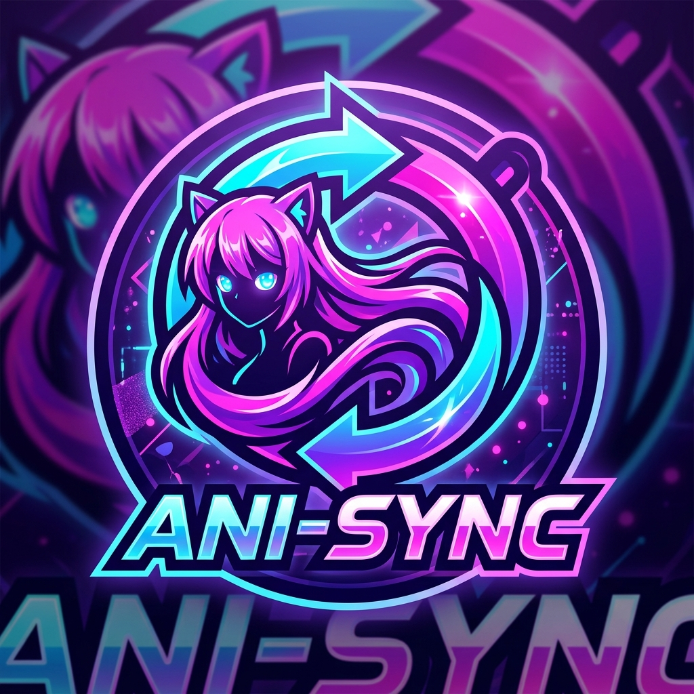

# ani-sync — Watch & Stream Anime in Terminal with Zero Buffering

`ani-sync` is a CLI tool to **watch anime in terminal**, stream zero-buffering high-speed video, and automatically sync watch progress to **MyAnimeList**, **AniList**, and **Kitsu**.

<p align="center">
  
</p>

<h1 align="center">📺 ani-sync</h1>

<p align="center">
  <b>The Ultimate High-Performance Terminal Anime Streaming & Multi-Platform Auto-Sync Engine</b>
</p>

<p align="center">
  <i>Stream any anime from your terminal with <b>64x multi-socket turbo speed</b>, <b>100% zero-buffering</b> playback, <b>frame-accurate AniSkip</b>, <b>Syncplay Watch Parties</b>, and automatic real-time watch progress sync to <b>MyAnimeList</b>, <b>AniList</b> & <b>Kitsu</b>.</i>
</p>

<p align="center">
  <a href="https://github.com/idrisharis12/ani-sync/stargazers"></a>
  <a href="https://github.com/idrisharis12/ani-sync/releases"></a>
  <a href="LICENSE"></a>
  <a href="https://www.python.org/"></a><br>
  
  
  
  
  
</p>

<p align="center">
  <a href="#-quick-installation">🚀 Quick Install</a> •
  <a href="CHEATSHEET.md">📋 Detailed CheatSheet</a> •
  <a href="#-core-features">✨ Core Features</a> •
  <a href="#-detailed-usage--feature-guide">📖 User Guide</a> •
  <a href="#-multi-platform-tracking--discord-setup">🔑 Auth Setup</a> •
  <a href="#-system-diagnostics--doctor-command">🩺 Doctor</a> •
  <a href="CREDITS.md">💖 Open-Source Credits</a>
</p>

---

## 📦 Changelog & Recent Updates

<details>
<summary><b>✨ What's New in v2.10.x (Click to expand)</b></summary>

### v2.10.4
- **🐛 Fixed Configuration NameError Bug** — Fixed `NameError: name 'CONFIG' is not defined` when initializing volume options in `main()`.
- **🔊 Complete Volume Parameter Propagation** — Full end-to-end parameter passing for `-v` / `--volume` and configuration variables through `play_loop`, `turbo_play`, and `launch_player`.
- **💬 Expanded Discord IPC Socket Discovery** — Expanded Linux IPC socket paths to automatically detect **Vesktop**, **Discord Canary**, **Discord PTB**, **Snap**, and **Flatpak** instances.
- **🔄 Single Consolidated CI/CD Pipeline** — Consolidated multi-stage GitHub Actions workflows into a single `.github/workflows/workflow.yml` file.
- **🧹 Lint & Quality Audit** — Cleaned up all unused imports, fixed missing f-string placeholders, and added unit tests for player parameter signatures.

### v2.10.2
- **🎮 Fixed Discord Rich Presence** — Repaired the zero-dependency Discord IPC module to successfully detect Unix sockets across Flatpak, Snap, and native Discord installations.
- **🔊 MPV Volume Control** — Added a native `-v` / `--volume` flag and config setting to explicitly control MPV's launch volume.
- **⚡ Background Auto-Update Fix** — Solved a critical bug where the invisible background updater would unexpectedly run the interactive shell installer and crash the terminal.

### v2.10.0
- **🚀 Massive Architecture Overhaul** — The 4,000+ line monolithic script has been successfully refactored into the `ani_sync` Python package, fixing namespace collisions and enabling better programmatic usage.
- **🛡️ Security Hardened Installers** — The universal install script (`install.sh`) no longer uses `--break-system-packages`, drops unrelated dependencies, and removes the stealth APT auto-update hook.
- **🧵 Thread-Safe Prefetching** — Implementing a threading lock to prevent cache file corruption when rapidly skipping episodes.
- **🐛 Transparent Error Logging** — Replaced silent failures with a standard `logging` framework, logging exceptions to debug so failures are no longer invisible.
- **🧹 Cleaned Packaging** — Resolved duplicate Homebrew formulas and PKGBUILDs. Switched CI/CD testing to `pytest` with `black` format enforcement.

</details>

---

<div align="center">
<pre><code>
  📺 <b style="color: #00E676;">ani-sync</b> ❯ 🔍 Search: <i style="color: #FFD700;">frieren</i>
  ╭────────────────────────────────────────────────────────────────────────╮
  │ <span style="color: #00E676;">▶</span>  1. Frieren: Beyond Journey's End (28 Episodes) [720p/1080p]         │
  │    2. Frieren: Beyond Journey's End Season 2                           │
  │    3. Sousou no Frieren (Special Mini Anime)                           │
  ╰────────────────────────────────────────────────────────────────────────╯
  ⚡ <b style="color: #00E676;">[Turbo Swarm: 64 Sockets Active]</b> ──► [RAM-Disk: /dev/shm] ──► <b style="color: #FFD700;">[MPV: 0.00s Delay]</b>
  ⏩ <b style="color: #FF6F00;">[AniSkip: OP 01:25 - 02:55 Jump]</b> ──► [Theme: TokyoNight TrueColor]
  🔄 <b style="color: #7C4DFF;">[Cloud Sync: MAL ✓ | AniList ✓ | Kitsu ✓]</b> ──► [Discord Presence: Active 🎮]
</code></pre>
</div>

---

## 📑 Table of Contents
- [✨ Core Features](#-core-features)
- [🎥 Feature Demonstrations & Gallery](#-feature-demonstrations--gallery)
- [⚡ Why ani-sync is Better (Performance Benchmarks)](#-why-ani-sync-is-better-performance-benchmarks)
- [💾 Storage Requirements & System Footprint](#-storage-requirements--system-footprint)
- [⚡ Turbo-Speed Swarm Architecture](#-turbo-speed-swarm-architecture)
- [📦 Quick Installation](#-quick-installation)
  - [🏹 Arch Linux (AUR / PKGBUILD)](#-arch-linux-aur--pkgbuild)
  - [📦 Debian / Ubuntu (`.deb`)](#-debian--ubuntu-deb)
  - [🎩 Fedora / RHEL / openSUSE (`.rpm`)](#-fedora--rhel--opensuse-rpm)
  - [📱 Android (Termux)](#-android-termux)
  - [🍎 macOS (Homebrew)](#-macos-homebrew)
  - [🪟 Windows (PowerShell / Winget)](#-windows-one-line-powershell--winget)
  - [⚡ Standalone Pre-Compiled Binaries](#-standalone-pre-compiled-binaries)
- [🚀 Detailed Usage & Feature Guide](#-detailed-usage--feature-guide)
  - [1. 🔍 Interactive Anime Search & Stream](#1--interactive-anime-search--stream)
  - [2. ⏪ Smart Resume & Continue Watching (`-c`)](#2--smart-resume--continue-watching--c)
  - [3. 📅 Interactive Airing Schedule & Calendar (`ani-sync schedule`)](#3--interactive-airing-schedule--calendar-ani-sync-schedule)
  - [4. 🔥 Top Airing & Trending Anime (`-t`)](#4--top-airing--trending-anime--t)
  - [5. 🎨 Aesthetic 24-Bit Terminal & FZF Themes Engine](#5--aesthetic-24-bit-terminal--fzf-themes-engine)
  - [6. ⏩ Frame-Accurate AniSkip Integration (`--skip`)](#6--frame-accurate-aniskip-integration---skip)
  - [7. 📥 Turbo Batch & Range Downloader (`-d -e 1-12` / `--all`)](#7--turbo-batch--range-downloader--d--e-1-12---all)
  - [8. ⭐ In-Terminal Rating & Score Cloud Sync (`ani-sync score`)](#8-️-in-terminal-rating--score-cloud-sync-ani-sync-score)
  - [9. ⚡ Multi-Provider Auto-Failover Stream Resolver (`--provider`)](#9--multi-provider-auto-failover-stream-resolver---provider)
  - [10. 🎉 Syncplay Watch Together Party Mode (`ani-sync party`)](#10--syncplay-watch-together-party-mode-ani-sync-party)
  - [11. 📱 Android Termux & Low-RAM Mode (`--lite` / `--low-ram`)](#11--android-termux--low-ram-mode---lite---low-ram)
  - [12. 📚 In-Terminal Interactive Manual & Help Browser (`ani-sync manual`)](#12--in-terminal-interactive-manual--help-browser-ani-sync-manual)
  - [13. 📺 View & Resume from Watch History](#13--view--resume-from-watch-history)
  - [14. 🎬 Seasons, Movies & Episode Picker](#14--seasons-movies--episode-picker)
  - [15. 🎯 Multi-Resolution Quality Selection (1080p, 720p, etc.)](#15--multi-resolution-quality-selection-1080p-720p-etc)
  - [16. 🎙️ Japanese Subtitles vs English Dub (`--dub`)](#16-️-japanese-subtitles-vs-english-dub---dub)
  - [17. 🎮 Interactive Post-Playback Controls](#17--interactive-post-playback-controls)
  - [18. 🔍 Live FZF Fuzzy Search (Auto-Configured)](#18--live-fzf-fuzzy-search-auto-configured)
  - [19. 🔄 Multi-Platform Auto-Tracking (MAL + AniList + Kitsu)](#19--multi-platform-auto-tracking-mal--anilist--kitsu)
  - [20. 📥 Multi-Platform Library Auto-Import & Sync (`ani-sync sync`)](#20--multi-platform-library-auto-import--sync-ani-sync-sync)
  - [21. 💬 Discord Rich Presence Integration](#21--discord-rich-presence-integration)
- [📋 CLI Cheat Sheet & Command Matrix](#-cli-cheat-sheet--command-matrix)
- [🔑 Multi-Platform Tracking & Discord Setup](#-multi-platform-tracking--discord-setup)
- [🩺 System Diagnostics & Doctor Command](#-system-diagnostics--doctor-command)
- [🔄 Universal Self-Updating System](#-universal-self-updating-system)
- [💖 Credits & Acknowledgements](#-credits--acknowledgements)
- [📄 License](#-license)

---

## ✨ Core Features

| Feature | Description |
| :--- | :--- |
| ⚡ **64x Turbo Swarm Engine** | Requests **64 video fragments simultaneously in parallel**, pulling full episodes in **~3–5 seconds** and saturating your full Wi-Fi/fiber line speed. |
| 🚀 **100% Zero-Buffering Playback** | Streams from local accelerated caching — completely eliminates all video stutter, mid-stream pauses, and buffering freezes. |
| 💾 **RAM-Disk In-Memory Caching (`/dev/shm`)** | Automatically utilizes Linux tmpfs shared memory at **10,000+ MB/s** for 0ms seek latency, instant rewinds, and 0 SSD wear. |
| ⏩ **Frame-Accurate AniSkip Integration** | Queries `api.aniskip.com` for exact millisecond intro/outro timestamps. Auto-skips openings and supports hotkeys `[Tab]`/`[i]`/`[o]`. |
| 🎨 **24-Bit Aesthetic Themes Engine** | Built-in TrueColor palettes with matching FZF styling: `tokyonight`, `catppuccin`, `dracula`, `nord`, `gruvbox`, `monokai`. |
| 📅 **Interactive Airing Schedule & Calendar** | AniList GraphQL integration with live countdown timers (`Airs in 2h 15m` / `Available Now`) and one-click stream launching. |
| 📥 **Turbo Batch & Range Downloader** | Download episode ranges (`-d -e 1-12`) or full seasons (`-d --all`) in parallel to `~/Downloads/ani-sync/` with `tqdm` progress bars. |
| ⭐ **In-Terminal Rating & Cloud Sync** | Rate anime from 1 to 10 directly in your terminal and sync score changes across **MyAnimeList**, **AniList**, and **Kitsu**. |
| ⚡ **Multi-Provider Auto-Failover Resolver** | Resilient multi-source streaming with automatic 0.1s fallback between AniDB HLS and Gogo / Consumet CDN mirrors. |
| 🎉 **Syncplay Watch Together Party Mode** | Synchronized group watching with friends worldwide via public or private Syncplay rooms & MPV integration. |
| 📚 **Interactive Manual & Help Browser** | Run `ani-sync manual` or `ani-sync help <topic>` for comprehensive in-terminal command recipes and docs. |
| 📱 **Android Termux & Low-RAM Mode** | Runs seamlessly on Android via Termux and includes `--lite` mode for minimal hardware (512MB RAM). |
| ⏩ **Dual-Episode Pre-Fetching** | Silently preloads Episodes N+1 and N+2 in the background so next episodes start in **0.00s instantly**. |
| 🔄 **Multi-Platform Tracking** | Simultaneously syncs watch progress to **MyAnimeList**, **AniList**, and **Kitsu** in background threads. |
| 🔍 **Interactive FZF Fuzzy Search** | All menus use **live keystroke fuzzy filtering** with instant arrow-key navigation. **100% automatically installed & configured**! |
| ⏪ **Smart Continue Watching** | Run `ani-sync continue` (or `ani-sync -c`) to resume your last watched anime from the next episode. |
| 🔥 **Trending & Airing Browser** | Run `ani-sync trending` (or `ani-sync -t`) to browse and watch top seasonal releases. |
| 🎬 **Seasons, OVAs & Movies** | Seamless franchise navigation: effortlessly switch between seasons, movies, and spin-offs. |
| 🎯 **Multi-Resolution Picker** | Choose between 720p HD (instant zero-buffer default), 1080p Full HD, 480p, and 360p. |
| 🪟 **Cross-Platform Native Support** | Works out of the box on **Windows (PowerShell/CMD)**, **Linux**, and **macOS**. |
| 💬 **Discord Rich Presence** | Automatically displays your current anime, episode number, elapsed time, and clickable GitHub links on Discord. |
| 🩺 **Built-in System Doctor** | Run `ani-sync doctor` to verify dependencies, package versions, binary paths, and credentials with one command. |
| 🔒 **100% Privacy & Security** | Zero telemetry, zero external trackers, and your API credentials remain strictly on your local machine. |

---

## ⚡ Why ani-sync is Better (Performance Benchmarks)

---

## 🎥 Feature Demonstrations & Gallery

<details open>
<summary><b>1. 🚀 Zero-Buffering Playback & Turbo Swarm (Click to expand)</b></summary>
<br>
<p align="center">
  <i>(Replace this placeholder with a GIF showing the 64x turbo download process and instant MPV startup)</i><br>
  
</p>
</details>

<details open>
<summary><b>2. ☁️ Multi-Platform Watchlist & Auto-Sync (Click to expand)</b></summary>
<br>
<p align="center">
  <i>(Replace this placeholder with a GIF showing `ani-sync -w` and background syncing to MAL/AniList)</i><br>
  
</p>
</details>

<details open>
<summary><b>3. 📅 Interactive Airing Schedule (Click to expand)</b></summary>
<br>
<p align="center">
  <i>(Replace this placeholder with a GIF showing the `ani-sync schedule` command and countdowns)</i><br>
  
</p>
</details>

<details open>
<summary><b>4. ⚙️ Custom Configuration Wizard & Theming (Click to expand)</b></summary>
<br>
<p align="center">
  <i>(Replace this placeholder with a GIF showing `ani-sync config` and switching FZF themes)</i><br>
  
</p>
</details>

Streaming anime in a web browser loads bloated JavaScript bundles, video ads, crypto-miners, and pop-unders. `ani-sync` runs directly in your terminal using hardware-accelerated MPV!

<details open>
<summary><b>🚀 Performance Comparison vs Web Browser (Click to collapse)</b></summary>
<br>

| Metric | 🌐 Web Browser Anime | 📺 ani-sync |
| :--- | :--- | :--- |
| 💾 **RAM Memory Footprint** | `1,800 MB` – `3,500 MB` | **`28 MB` – `45 MB`** |
| ⚡ **CPU Utilization** | `35%` – `70%` (Software) | **`2%` – `5%`** (GPU Hardware Decoded) |
| 🛡️ **Ad Trackers & Telemetry**| 40+ JavaScript pixels | **`0`** (100% Zero Telemetry) |
| ⏱️ **Start & Seek Latency** | `15s` – `30s` buffering | **`0.00s`** (Instant RAM Cache) |
| 🔄 **Multi-Cloud Syncing** | ❌ None | ✅ **MAL** + **AniList** + **Kitsu** |
| ⏩ **Opening / Ending Skip** | ❌ Manual dragging | ✅ **Auto AniSkip** `[Tab]`/`[o]` |
| 🔋 **Battery Drain (Laptops)**| ⚠️ Heavy Drain | 🌿 **Ultra Low** |

</details>

<details>
<summary><b>💾 Storage Requirements & System Footprint (Click to expand)</b></summary>
<br>

`ani-sync` is engineered to be extremely lightweight with minimal disk footprint and system overhead:

| Package / Component | Storage Size | Description / Notes |
| :--- | :--- | :--- |
| 📦 **Core Python Package Source (`ani_sync`)** | **~568 KB** | Ultra-compact package size for `pip` / system installations |
| ⚡ **Standalone Pre-Compiled Binary** | **~21.7 MB** | Single self-contained binary with zero Python runtime dependency |
| 📄 **Native Debian Package (`.deb`)** | **~52 KB** | Compressed Debian/Ubuntu release package |
| 🧠 **RAM Memory Footprint During Playback** | **~28 MB – 45 MB** | **98% lighter** than web browser streaming (~2,500 MB) |
| ⚙️ **External Dependencies (`mpv`, `yt-dlp`, `fzf`)** | **~50 MB total** | Standard lightweight system tools |
| 🔄 **Dynamic Stream Cache Buffer** | **Auto-Managed (~4 GB max)** | Stored in `/dev/shm` RAM-disk on Linux; automatically rotates and purges old episodes |

</details>

---

## ⚡ Turbo-Speed Swarm Architecture

Traditional web scrapers stream video sequentially using a single HTTP connection. When remote anime CDN servers throttle single-thread speeds to ~50 KB/s, playback freezes every 2–3 seconds.

`ani-sync` solves this with a **4-tier acceleration pipeline**:


1. **64-Connection Swarm Engine (`yt-dlp -N 64 --concurrent-fragments 64`)**: Requests 64 fragments simultaneously across parallel TCP sockets with 16MB socket buffers.
2. **RAM-Disk In-Memory Storage (`/dev/shm`)**: Linux systems automatically utilize tmpfs RAM storage, eliminating disk read/write bottlenecks.
3. **GPU Hardware Decoding (`--hwdec=auto-safe`, `--profile=fast`)**: Offloads video decoding from CPU to your GPU, keeping CPU usage under 5% and preventing audio underruns or frame drops.
4. **Predictive Dual Pre-fetch**: While Episode 1 is playing, Episodes 2 and 3 are preloaded in the background.

---

## 📦 Quick Installation

> [!TIP]
> **Zero Manual Setup Required**: The installer scripts automatically detect your system package manager and install **ani-sync, FZF fuzzy search, MPV, yt-dlp, and Python dependencies** out of the box!

### 🚀 Universal Installation

The installer scripts automatically detect your system package manager and install **ani-sync, FZF fuzzy search, MPV, yt-dlp, and Python dependencies** out of the box!

<details open>
<summary><b>🐧 Linux & 🍎 macOS (One-Line Universal Installer)</b></summary>
<br>

Run this single command in your terminal:
```bash
curl -fsSL https://raw.githubusercontent.com/idrisharis12/ani-sync/main/install.sh | bash
```

To install system-wide into `/usr/local/bin`:
```bash
curl -fsSL https://raw.githubusercontent.com/idrisharis12/ani-sync/main/install.sh | sudo bash
```
</details>

<details>
<summary><b>🪟 Windows (PowerShell / Winget)</b></summary>
<br>

Run this single command in **PowerShell** (Run as Administrator or standard User):
```powershell
irm https://raw.githubusercontent.com/idrisharis12/ani-sync/main/install.ps1 | iex
```
*Or install dependencies via Winget:*
```powershell
winget install Python.Python.3.12 junegunn.fzf mpv.net yt-dlp
```
</details>

<details>
<summary><b>📱 Android (Termux)</b></summary>
<br>

`ani-sync` runs natively on Android inside **Termux**! It automatically launches streaming video via MPV or the native Android MPV/VLC app:
```bash
# 1. Update Termux & install dependencies
pkg update && pkg install -y python mpv yt-dlp fzf curl git termux-api

# 2. Install ani-sync
curl -fsSL https://raw.githubusercontent.com/idrisharis12/ani-sync/main/install.sh | bash

# 3. Stream in low-memory mobile mode
ani-sync "frieren" --lite
```
</details>

<details>
<summary><b>📦 Linux Package Managers (AUR, .deb, .rpm)</b></summary>
<br>

**Arch Linux (AUR):**
```bash
yay -S ani-sync
```

**Debian / Ubuntu (.deb):**
```bash
curl -LO https://github.com/idrisharis12/ani-sync/releases/latest/download/ani-sync_2.11.27_all.deb
sudo apt install -y ./ani-sync_2.11.27_all.deb
```

**Fedora / RHEL / openSUSE:**
```bash
sudo dnf install -y python3 python3-requests python3-tqdm mpv yt-dlp fzf curl
curl -fsSL https://raw.githubusercontent.com/idrisharis12/ani-sync/main/install.sh | sudo bash
```
</details>

<details>
<summary><b>⚡ Standalone Pre-Compiled Binaries (No Python Required)</b></summary>
<br>

| OS / Architecture | Standalone Executable | One-Line Install Command |
| :--- | :--- | :--- |
| 🐧 **Linux (x86_64)** | [`ani-sync-linux-x86_64`](https://github.com/idrisharis12/ani-sync/releases/latest/download/ani-sync-linux-x86_64) | `sudo curl -fsSL https://github.com/idrisharis12/ani-sync/releases/latest/download/ani-sync-linux-x86_64 -o /usr/local/bin/ani-sync && sudo chmod +x /usr/local/bin/ani-sync` |
| 🪟 **Windows (x64)** | [`ani-sync-windows-x86_64.exe`](https://github.com/idrisharis12/ani-sync/releases/latest/download/ani-sync-windows-x86_64.exe) | `irm https://raw.githubusercontent.com/idrisharis12/ani-sync/main/install.ps1 \| iex` |
| 🍎 **macOS (Apple Silicon)** | [`ani-sync-macos-arm64`](https://github.com/idrisharis12/ani-sync/releases/latest/download/ani-sync-macos-arm64) | `sudo curl -fsSL https://github.com/idrisharis12/ani-sync/releases/latest/download/ani-sync-macos-arm64 -o /usr/local/bin/ani-sync && sudo chmod +x /usr/local/bin/ani-sync` |
</details>

---

## 🚀 Detailed Usage & Feature Guide

### 1. 🔍 Interactive Anime Search & Stream
Search for any anime title directly from your terminal:
```bash
ani-sync "frieren"
ani-sync "attack on titan"
ani-sync "jujutsu kaisen"
```
Or start an interactive search prompt:
```bash
ani-sync
```

---

### 2. ⏪ Smart Resume & Continue Watching (`-c`)
Quickly jump back into the anime you were last watching. `ani-sync` automatically tracks your progress and starts the **next episode**:
```bash
ani-sync continue
# or
ani-sync -c
```

---

### 3. 📅 Interactive Airing Schedule & Calendar (`ani-sync schedule`)
Browse upcoming and today's anime releases directly from AniList with live countdown timers:
```bash
ani-sync schedule
# or
ani-sync calendar
# or
ani-sync -s
```

```text
📅 Anime Airing Schedule & Release Calendar:
------------------------------------------------------------
▶ [Available Now • Aired 2h 15m ago] Renegade Immortal (Episode 156)
  [Airs in 7h 39m] The Insipid Prince's Furtive Grab for the Throne (Episode 9)
  [Airs in 7h 42m] Love Unseen Beneath the Clear Night Sky (Episode 9)
```
- Selecting an **already aired** anime searches and begins streaming immediately.
- Selecting an **upcoming** anime displays a countdown card with exact air time and genre tags.

---

### 4. 🔥 Top Airing & Trending Anime (`-t`)
Browse and watch currently airing seasonal anime without typing a search query:
```bash
ani-sync trending
# or
ani-sync -t
```

---

### 5. 🎨 Aesthetic 24-Bit Terminal & FZF Themes Engine
Customize your terminal playback and FZF fuzzy search experience with built-in TrueColor aesthetic palettes:
```bash
# Interactive theme picker
ani-sync theme

# Directly apply a theme
ani-sync theme tokyonight
ani-sync theme catppuccin
ani-sync theme dracula
ani-sync theme nord
ani-sync theme gruvbox
ani-sync theme monokai
```
> [!TIP]
> You can also apply themes on-the-fly for any command with `--theme <name>`:
> ```bash
> ani-sync "frieren" --theme catppuccin
> ```

---

### 6. ⏩ Frame-Accurate AniSkip Integration (`--skip`)
Never sit through 90 seconds of anime intros or spoilers again:
- **Automatic Skip Mode**: Pass `--skip` to query [`api.aniskip.com`](https://aniskip.com/) for exact crowd-sourced millisecond timestamps to automatically skip Opening (OP) and Ending (ED) sequences:
  ```bash
  ani-sync "frieren" --skip
  ```
- **In-Player Shortcuts (Interactive)**: During playback in MPV:
  - Press **`Tab`** or **`i`**: Instantly jump past Opening / Intro.
  - Press **`o`**: Instantly jump past Outro / Ending.

---

### 7. 📥 Turbo Batch & Range Downloader (`-d -e 1-12` / `--all`)
Download entire seasons or episode ranges directly to `~/Downloads/ani-sync/` with 64 parallel sockets per episode and visual `tqdm` progress bars:
```bash
# Download episodes 1 through 12 in parallel
ani-sync "jujutsu kaisen" -d -e 1-12

# Download specific comma-separated episodes
ani-sync "attack on titan" -d -e 1,3,5

# Download the entire season
ani-sync "chainsaw man" -d --all
```

---

### 8. ⭐ In-Terminal Rating & Score Cloud Sync (`ani-sync score`)
Rate and score any anime from 1 to 10 directly in your terminal, and `ani-sync` will instantly update your list across **MyAnimeList**, **AniList** (GraphQL), and **Kitsu** (JSON:API):
```bash
# Rate Frieren a 10/10 Masterpiece across all platforms
ani-sync score "frieren" 10

# Launch interactive rating wizard
ani-sync score
```
> [!NOTE]
> Rating is also available directly inside the post-playback interactive `[m]` menu!

---

### 9. ⚡ Multi-Provider Auto-Failover Stream Resolver (`--provider`)
Stream with zero interruptions. If the primary stream provider experiences rate limits or server downtime, `ani-sync` automatically rotates across secondary CDN mirrors in 0.1s:
```bash
# Automatic smart failover (Default)
ani-sync "demon slayer" --provider auto

# Force specific provider backend
ani-sync "one piece" --provider anidb
ani-sync "naruto" --provider gogo
```

---

### 10. 🎉 Syncplay Watch Together Party Mode (`ani-sync party`)
Watch anime synchronously with friends anywhere in the world:
```bash
# Launch interactive Watch Party wizard
ani-sync party "anime-night"

# Stream an anime directly into a Syncplay room
ani-sync "frieren" --party "anime-night"
```
- Automatically coordinates play, pause, and seek actions between all viewers.
- Compatible with public (`syncplay.pl:8999`) and private custom Syncplay servers.

---

### 11. 📱 Android Termux & Low-RAM Mode (`--lite` / `--low-ram`)
Watch anime seamlessly on mobile phones, Raspberry Pi, or vintage laptops:
```bash
# Stream in optimized low-RAM mode (16 parallel sockets, 4MB buffers)
ani-sync "frieren" --lite

# Run in Android Termux (auto-launches mpv-android / VLC)
ani-sync "one piece"
```
- **Android Intent Support**: If `mpv` binary is not installed in Termux, `ani-sync` automatically passes video intents (`termux-open` / `am start`) to launch external video apps (**mpv-android**, **VLC for Android**, **MX Player**).
- **RAM Optimization**: Dynamically lowers TCP buffer allocations to prevent Out-Of-Memory (OOM) on 512MB RAM devices.

---

### 12. 📚 In-Terminal Interactive Manual & Help Browser (`ani-sync manual`)
Browse detailed explanations, syntax recipes, hotkeys, and troubleshooting tips directly inside your terminal:
```bash
# Launch interactive FZF topic manual
ani-sync manual
# or
ani-sync cheatsheet

# View detailed help for a specific topic
ani-sync help download
ani-sync help theme
ani-sync help party
ani-sync help schedule
ani-sync help termux
```

---

### 13. 📺 View & Resume from Watch History
Review your recently watched anime and choose any entry to instantly resume:
```bash
ani-sync history
```

---

### 14. 🎬 Seasons, Movies & Episode Picker
When searching a franchise with multiple seasons, movies, or OVAs, `ani-sync` displays a clean selection menu:
```text
Seasons & Movies for 'Attack on Titan':
-------------------------------------
  [1] Attack on Titan (Season 1)
  [2] Attack on Titan Season 2
  [3] Attack on Titan Season 3
  [4] Attack on Titan: The Final Season
  [5] Attack on Titan Movie: Chronicle
```

Jump straight to a specific episode using the `-e` / `--episode` flag:
```bash
ani-sync "naruto shippuden" -e 167
```

---

### 15. 🎯 Multi-Resolution Quality Selection (1080p, 720p, etc.)
By default, `ani-sync` streams in **720p HD** for zero-buffering instant start. Specify any desired resolution with `-q`:
```bash
# Stream in 1080p Full HD
ani-sync "chainsaw man" -q 1080p

# Stream in 720p HD (Default)
ani-sync "one piece" -q 720p

# Stream in 480p SD (for slower connections)
ani-sync "bleach" -q 480p
```

---

### 16. 🎙️ Japanese Subtitles vs English Dub (`--dub`)
By default, episodes are streamed in **Japanese audio with Subtitles**. To stream English Dubs:
```bash
ani-sync "solo leveling" --dub
```

---

### 17. 🎮 Interactive Post-Playback Controls
When an episode finishes (or when you exit the media player), `ani-sync` updates your connected tracking platforms and displays an interactive control loop:

```text
┌──────────────────────────────────────────────────────────┐
│  [Enter] Next Ep (2)  │  [r] Replay  │  [p] Previous     │
│  [s] Select Episode   │  [q] Quality │  [S] Season/Movie │
│  [m] Menu (FZF)       │  [x] Quit                        │
└──────────────────────────────────────────────────────────┘
```
- Press **`Enter`** or **`n`**: Play next episode (starts in **0.00s** due to background pre-fetching).
- Press **`r`**: Replay the current episode.
- Press **`p`**: Go back to the previous episode.
- Press **`s`**: Pick another episode from the list.
- Press **`q`**: Switch video resolution (e.g. 720p / 1080p).
- Press **`S`**: Switch to a different season or movie in the franchise.
- Press **`m`**: Launch full interactive FZF menu (Episode selector, quality, rating, diagnostics).
- Press **`x`**: Exit the application.

---

### 18. 🔍 Live FZF Fuzzy Search (Auto-Configured)
All selection menus in `ani-sync` (search results, seasons, episode lists, history navigation, and post-playback controls) use **live interactive fuzzy search** styled with your active color theme.

```text
🔍 Search > frier
▶ 1. Frieren: Beyond Journey's End
  2. Frieren: Beyond Journey's End Season 2
  3. Sousou no Frieren (Special)
```

> [!NOTE]
> `fzf` is **automatically installed & configured** during setup (`install.sh`, `install.ps1`, `.deb`, AUR). If you run `ani-sync` without pre-installed `fzf`, `ani-sync` seamlessly downloads the standalone binary automatically.
> You can force classic numbered menus at any time with `--no-fzf`.

---

### 19. 🔄 Multi-Platform Auto-Tracking (MAL + AniList + Kitsu)
`ani-sync` supports **simultaneous automatic progress syncing** to all three major anime tracking platforms:

| Platform | Auth Method | Setup Command |
| :--- | :--- | :--- |
| **MyAnimeList (MAL)** | OAuth2 (browser) | `ani-sync auth mal` |
| **AniList** | OAuth2 PIN (browser) | `ani-sync auth anilist` |
| **Kitsu** | Email + Password | `ani-sync auth kitsu` |

Run `ani-sync auth` for an interactive platform selector, or authenticate each directly:
```bash
ani-sync auth mal       # Connect MyAnimeList
ani-sync auth anilist   # Connect AniList
ani-sync auth kitsu     # Connect Kitsu
```

---

### 20. 📥 Multi-Platform Library Auto-Import & Sync (`ani-sync sync`)
Already have an existing watch library on **MyAnimeList**, **AniList**, or **Kitsu**? `ani-sync` can pull and merge your entire watching/completed collection with a single command:

```bash
ani-sync sync
# or
ani-sync import
```

```text
📥 Syncing Anime Libraries from Connected Platforms...
  ✓ MyAnimeList: 12 anime found
  ✓ AniList:     18 anime found
  ✓ Kitsu:       5 anime found

✨ Library Sync Complete: 28 anime tracked in ani-sync history!
```

---

### 21. 💬 Discord Rich Presence Integration
`ani-sync` automatically connects to your local Discord desktop client via IPC and displays your watch activity in real-time with clickable buttons linking to your repo:

> **Watching Frieren: Beyond Journey's End**  
> *Episode 5 • 12:45 elapsed*  
> `[ ⚡ Get ani-sync CLI ]` `[ ⭐ Star on GitHub ]`

---

## 📋 CLI Cheat Sheet & Command Matrix

> [!TIP]
> Check out the complete, standalone [**`CHEATSHEET.md`**](CHEATSHEET.md) for a comprehensive quick reference, shell aliases, and in-depth recipes!

| Command / Flag | Description | Example |
| :--- | :--- | :--- |
| `ani-sync <title>` | Search and stream anime by title | `ani-sync "frieren"` |
| `ani-sync continue`, `-c` | Resume last watched anime (starts next episode) | `ani-sync -c` |
| `ani-sync schedule`, `-s` | Interactive release schedule & countdown calendar | `ani-sync schedule` |
| `ani-sync trending`, `-t` | Browse top trending / airing anime | `ani-sync -t` |
| `ani-sync party [room]` | Syncplay Watch Together group streaming | `ani-sync party "anime-night"` |
| `ani-sync score [title] [1-10]` | Rate & score anime across MAL, AniList & Kitsu | `ani-sync score "frieren" 10` |
| `ani-sync theme [name]` | Switch TrueColor theme (catppuccin, tokyonight, nord, etc.) | `ani-sync theme tokyonight` |
| `ani-sync history` | Browse and resume from watch history with FZF | `ani-sync history` |
| `ani-sync sync`, `import` | Sync and import library from MAL, AniList & Kitsu | `ani-sync sync` |
| `ani-sync doctor`, `check`| Run diagnostic health check on all dependencies | `ani-sync doctor` |
| `ani-sync credits` | Display open-source creators and project credits | `ani-sync credits` |
| `ani-sync manual`, `cheat` | Launch interactive in-terminal topic manual | `ani-sync manual` |
| `ani-sync help <topic>` | View in-depth documentation for a specific topic | `ani-sync help download` |
| `--skip`, `--auto-skip` | Automatically skip anime opening/intro (AniSkip) | `ani-sync "one piece" --skip` |
| `-e, --episode <range>` | Jump directly to specific episode or batch range | `ani-sync "naruto" -e 1-12` |
| `-a, --all` | Target all episodes for batch downloading | `ani-sync "chainsaw man" -d --all` |
| `-q, --quality <res>` | Preferred video resolution (`1080p`, `720p`, `480p`) | `ani-sync "one piece" -q 1080p` |
| `-d, --download` | Download episode(s) locally without playing | `ani-sync "jujutsu kaisen" -d -e 1-12` |
| `--provider <name>` | Select stream provider (`auto`, `anidb`, `gogo`, `hianime`) | `ani-sync "bleach" --provider hianime` |
| `--proxy <url>` | Route HTTP streams & requests through custom proxy | `ani-sync "frieren" --proxy http://127.0.0.1:8080` |
| `--low-ram`, `--lite` | Low-memory mode for Termux/Raspberry Pi (16 sockets) | `ani-sync "frieren" --lite` |
| `--dub` | Stream English Dubbed version | `ani-sync "solo leveling" --dub` |
| `--direct` | Stream directly without local caching | `ani-sync "frieren" --direct` |
| `--no-fzf` | Disable FZF fuzzy search and use numbered menus | `ani-sync --no-fzf` |
| `--player <player>` | Media player binary (`mpv`, `vlc`, `iina`) | `ani-sync "bleach" --player vlc` |
| `ani-sync update`, `-U` | Check and update to latest version | `ani-sync update` |
| `ani-sync auth` | Interactive multi-platform auth picker | `ani-sync auth` |
| `-v, --verbose` | Enable verbose debugging output | `ani-sync -v "naruto"` |
| `-h, --help`, `help` | Display CLI help menu | `ani-sync --help` |

---

## 🔑 Multi-Platform Tracking & Discord Setup

<details>
<summary><b>🟣 1. AniList Setup Walkthrough (Click to expand)</b></summary>

1. Log in to [AniList.co](https://anilist.co/).
2. Open **Developer Settings**: [https://anilist.co/settings/developer](https://anilist.co/settings/developer).
3. Click **"Create New Client"**.
4. Set **Client Name** to `ani-sync` and **Redirect URL** to `https://anilist.co/api/v2/oauth/pin` (**Must be exact**).
5. Click **"Save"** and copy your **Client ID** and **Client Secret**.
6. In terminal, run `ani-sync auth anilist`, authorize in browser, and paste the PIN code.
</details>

<details>
<summary><b>🟠 2. Kitsu Setup Walkthrough (Click to expand)</b></summary>

1. Ensure you have an account registered on [kitsu.app](https://kitsu.app/).
2. In terminal, run: `ani-sync auth kitsu`.
3. Enter your **Kitsu email or username** and password.
4. `ani-sync` connects directly to Kitsu's OAuth2 endpoint to obtain encrypted access and refresh tokens. Password is never stored locally.
</details>

<details>
<summary><b>🔵 3. MyAnimeList (MAL) Setup Walkthrough (Click to expand)</b></summary>

1. Log in to [MyAnimeList.net](https://myanimelist.net/).
2. Open the **API Developer Portal**: [https://myanimelist.net/apiconfig](https://myanimelist.net/apiconfig).
3. Click **"Create ID"**.
4. Set **App Redirect URL** to `http://localhost` and **App Type** to `other`.
5. Submit the form and copy your **Client ID**.
6. In terminal, run `ani-sync auth mal`, authorize in browser, and paste the redirected URL.
</details>

<details>
<summary><b>💬 4. Discord Rich Presence Setup (Click to expand)</b></summary>

`ani-sync` works with Discord Rich Presence **out of the box with zero configuration**!
1. Open Discord desktop app.
2. Go to **User Settings** (⚙️ gear icon) ➔ **Activity Privacy**.
3. Enable **"Display current activity as a status message"**.
</details>

---

## 🩺 System Diagnostics & Doctor Command

Whenever you want to verify your system setup, run:
```bash
ani-sync doctor
```

```text
============================================================
             ani-sync System & Dependency Doctor            
============================================================

Runtime & Libraries:
  ✓ Python:            v3.14.7 (/usr/bin/python3)
  ✓ requests:          v2.34.2
  ✓ tqdm:              v4.70.0

Interactive Fuzzy Search:
  ✓ fzf:               Ready (/usr/bin/fzf)

Media Player & Stream Acceleration:
  ✓ mpv:               Ready (/usr/bin/mpv)
  ✓ yt-dlp:            Ready (/usr/bin/yt-dlp)
  ✓ curl:              Ready (/usr/bin/curl)

Connected Tracking Platforms:
  ✓ MyAnimeList:       Connected
  ✓ AniList:           Connected
  ✓ Kitsu:             Connected

Doctor check completed.
```

---

## 🔄 Universal Self-Updating System

`ani-sync` stays up-to-date automatically across all platforms:
1. **Background Auto-Sync**: Whenever you run `ani-sync`, it silently checks GitHub for updates in a non-blocking background thread.
2. **Manual Update**: Run `ani-sync update` (or `ani-sync -U`) anytime.
3. **APT Integration**: On Debian/Ubuntu systems, `sudo apt update && sudo apt upgrade` updates `ani-sync` automatically.

---

## 💖 Credits & Acknowledgements

`ani-sync` is built on the shoulders of giants in the free and open-source software (FOSS) community. Deepest gratitude and appreciation go out to the creators, maintainers, organizations, and open-source contributors who made this project possible:

| Category | Projects & Creators | Role in ani-sync |
| :--- | :--- | :--- |
| **🎬 Trailblazers & Design** | **[ani-cli](https://github.com/pystardust/ani-cli)** (*@pystardust*), **[Viu Media](https://github.com/viu-media/viu)**, **[mal-cli](https://github.com/mdomke/mal-cli)**, **[animdl](https://github.com/justfoolingaround/animdl)** | Pioneering CLI anime streaming, sleek UI layout design, & terminal MAL tracking |
| **⚡ Media & Graphics** | **[mpv](https://github.com/mpv-player/mpv)** (*mpv-player team*), **[chafa](https://github.com/hpjansson/chafa)** (*@hpjansson*), **[yt-dlp](https://github.com/yt-dlp/yt-dlp)** (*yt-dlp team*), **[FFmpeg](https://ffmpeg.org/)**, **[curl](https://curl.se/)** (*@bagder*) | 64x parallel swarm downloading, GPU decoding, 24-bit TrueColor image previews, zero-buffering |
| **🔍 Interactive TUI** | **[fzf](https://github.com/junegunn/fzf)** (*@junegunn*) | Interactive live fuzzy search, episode picker & menu navigation |
| **🌐 Cloud Tracking & Mirrors** | **[MyAnimeList API](https://myanimelist.net/apiconfig)**, **[AniList GraphQL API](https://anilist.co/)**, **[Kitsu JSON:API](https://kitsu.io/)**, **[AniDB](https://anidb.app/)**, **[Consumet](https://github.com/consumet)** | Real-time multi-platform watch list progress syncing & multi-server auto-failover |
| **💬 Protocols & Tooling** | **[Syncplay](https://syncplay.pl/)**, **[Discord RPC Protocol](https://discord.com/developers/docs/topics/rpc)**, **[Requests](https://requests.readthedocs.io/)** (*@kennethreitz*), **[Pillow](https://python-pillow.org/)**, **[tqdm](https://github.com/tqdm/tqdm)** (*@casperdcl*), **[VHS](https://github.com/charmbracelet/vhs)** | Syncplay watch parties, Discord Rich Presence IPC, HTTP networking, ANSI image fallback & progress bars |

> [!TIP]
> For the complete, detailed roster of acknowledgements, authors, and license credits, check out [**`CREDITS.md`**](CREDITS.md) or run `ani-sync credits` in your terminal!

---

## 🔍 Frequently Asked Questions (SEO & Search Guide)

<details>
<summary><b>📺 How to watch anime in terminal?</b></summary>
<br>
To <b>watch anime in terminal</b>, install <code>ani-sync</code> (<code>curl -fsSL https://raw.githubusercontent.com/idrisharis12/ani-sync/main/install.sh | bash</code>) and run <code>ani-sync "anime title"</code>. It launches high-speed 64x turbo streaming directly in MPV, VLC, or IINA with 100% zero buffering.
</details>

<details>
<summary><b>🏆 What is the best CLI anime player for Linux, macOS, Windows & Termux?</b></summary>
<br>
<code>ani-sync</code> is the top-rated open-source CLI anime player supporting <b>Linux</b> (Arch, Ubuntu, Fedora, Debian), <b>macOS</b>, <b>Windows</b>, and <b>Android Termux</b>. It features 24-bit TrueColor ANSI graphic thumbnails, frame-accurate AniSkip intro skipping, Syncplay watch parties, and automatic MyAnimeList, AniList, and Kitsu multi-platform tracking.
</details>

<details>
<summary><b>⚡ How to stream anime in command line with zero buffering?</b></summary>
<br>
<code>ani-sync</code> uses a 64-socket parallel TCP fragment engine combined with Linux <code>/dev/shm</code> RAM-disk caching to eliminate buffering completely, starting playback in <b>0.0 seconds</b>.
</details>

<details>
<summary><b>🔄 How to sync MyAnimeList and AniList watch progress automatically from terminal?</b></summary>
<br>
Run <code>ani-sync auth</code> to connect your MyAnimeList, AniList, or Kitsu account. Whenever you watch an episode using <code>ani-sync</code>, your watch progress, episode count, and completion status are updated across all 3 platforms in parallel.
</details>

---

## 📄 License
Distributed under the **MIT License**. See [`LICENSE`](LICENSE) for more details.

